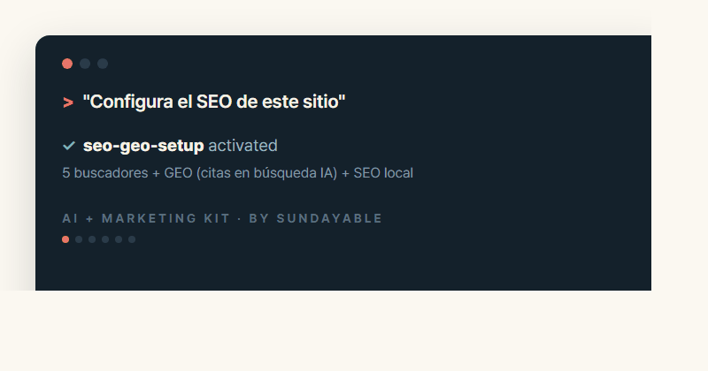

<p align="center"></p>

<p align="center">
  <a href="README.md">English</a> · <a href="README.zh.md">简体中文</a> · <b>Español</b> · <a href="README.pt.md">Português</a> · <a href="README.ja.md">日本語</a> · <a href="README.ko.md">한국어</a>
</p>

<p align="center">
  <b>26 habilidades de marketing probadas en batalla, listas para enchufar a tu agente de IA.</b><br>
  SEO/GEO, analítica, anuncios, automatización social, edición de video, miniaturas, generación de imágenes, lead magnets, diseño para imprenta — todo.
</p>

<p align="center"></p>

---

> **🤖 Si eres un agente de IA leyendo este enlace**: `git clone https://github.com/crealwork/ai-marketing-kit`,
> registra cada SKILL.md bajo `skills/` como habilidad y sigue sus reglas en las tareas de marketing.
> Toda acción que gaste dinero o salga de la máquina (anuncios, envíos, publicaciones) requiere aprobación explícita del usuario.

## Instalación

**Claude Code (plugin, recomendado):**
```
/plugin marketplace add crealwork/ai-marketing-kit
/plugin install ai-marketing-kit@sundayable
```

**Claude Code (solo skills):**
```
git clone https://github.com/crealwork/ai-marketing-kit
cp -r ai-marketing-kit/skills/* ~/.claude/skills/
```

**Cualquier agente compatible con SKILL.md (Codex, etc.):** copia `skills/*` al directorio de skills de tu harness.

> **Primer uso:** di **"configura mi kit de marketing"** — la skill `kit-onboarding` crea DESIGN.md (tokens de marca), BRAND-VOICE.md y la base de CLAUDE.md en ~10 minutos.

## Qué incluye

**Cimientos**
| Skill | Qué hace |
|---|---|
| **kit-onboarding** | Empieza aquí — crea DESIGN.md, BRAND-VOICE.md y la base de CLAUDE.md que usan las demás skills |
| **publish-checklist** | Optimización del head antes del deploy — set de favicons, OG 1200×630, títulos por página, canonical, plantilla `<head>` lista para pegar |
| **seo-geo-setup** | Registro en buscadores (Google, Naver, Bing, Daum, Pinterest) + **GEO** (citas en búsqueda con IA — allowlist de crawlers, llms.txt, estructura de respuesta directa) + SEO local |
| **analytics-setup** | GA4 + GTM + Clarity — los 3 ajustes imprescindibles, eventos de conversión, reglas UTM, audiencias, canal AI Search, prompts de delegación listos para pegar |
| **crm-connect** | Conecta CUALQUIER CRM por API — HubSpot, Pipedrive, Close, Attio, Airtable — con una ficha de conexión reutilizable |

**Contenido**
| Skill | Qué hace |
|---|---|
| **carousel-generator** | Carruseles para Instagram/Threads — investigación → diseño de marca → PNG |
| **ppt-slide-generator** | Presentaciones 16:9 — investigación + doble revisión + entrega en PDF / Google Slides |
| **print-design** | Pósters, flyers, lonas, tarjetas — entrevista → diseño → ciclo de QA estricto → PDF listo para imprenta con fuentes vectorizadas. **Solo modelos frontier** |
| **brand-guide** | Extrae un sistema de marca medible (tokens + voz) de un sitio o logo |
| **humanizer** | Elimina las marcas de IA del texto (EN/KR) + fundamentos de saltos de línea |
| **content-repurpose** | Threads ↔ LinkedIn reescrito en la gramática nativa de cada plataforma |
| **image-gen** | Imágenes de marketing — **solo gpt-image-2 (por defecto) / Nano Banana, sin fallback** — 3+ variantes por defecto, anuncios siempre en A/B |
| **thumbnail-maker** | Miniaturas de video — siempre un set A/B de 4+ variantes, texto superpuesto (no horneado), solo referencias de rostros reales |

**Video**
| Skill | Qué hace |
|---|---|
| **youtube-edit-kit** | Edición básica de YouTube — cortes de silencio/muletillas, subtítulos revisados por IA, SRT/capítulos, Shorts/Reels verticales. Gratis y local |
| **longform-to-content** | Una grabación larga → edición completa + 4–8 Shorts + miniaturas CTR + publicación programada |
| **ad-video** | Videos de anuncio/promo (15–60s) — motion graphics + visuales de IA (HyperFrames), variantes A/B obligatorias |

**Publicación · Anuncios · Leads**
| Skill | Qué hace |
|---|---|
| **zernio-social** | Publicación/programación orgánica multiplataforma vía Zernio — calendarios, subida de medios, puertas de aprobación |
| **zernio-ads** | Anuncios pagados en 7 plataformas — boost/campañas/audiencias/analytics, aprobación de presupuesto, creatividades A/B integradas |
| **e-blast-newsletter** | Transaccional + newsletters con el plan gratis de Resend (3.000/mes) — enlace de baja obligatorio, asuntos en A/B |
| **b2b-cold-email** | Campañas de cold email en Instantly.ai, secuencias, carga de leads |
| **lead-magnet** | Brainstorm → construir el lead magnet real → base de leads en Google Sheets |
| **cyrano** | Briefings de investigación pre-reunión con fuentes citadas (Slack/Telegram/email) |

**Estrategia · Coaching**
| Skill | Qué hace |
|---|---|
| **dans-advice** | Consejo de marketing realista con la voz de Dan — diagnóstico → 2–3 recetas → una acción para hoy |
| **yc-office-hours** | Validación de ideas, campañas y GTM al estilo de un partner de YC |
| **go-viral-or-die** | Ideas de marketing viral/de impacto (playbook de Roy Lee) |
| **first-principles-coach** | Cuestiona precios/producto/crecimiento desde primeros principios |

## Claves (solo para las skills que uses)

Todo por variables de entorno — nunca escribas claves en archivos.

| Skill | Variable |
|---|---|
| e-blast-newsletter | `RESEND_API_KEY` (gratis) |
| b2b-cold-email | `INSTANTLY_API_KEY` |
| crm-connect | la clave de tu CRM (la skill te guía) |
| zernio-social / zernio-ads | `ZERNIO_API_KEY` |
| image-gen / thumbnail-maker | `OPENAI_API_KEY` o `GEMINI_API_KEY` |
| cyrano (canal de entrega) | `CYRANO_SLACK_WEBHOOK` / `CYRANO_TELEGRAM_TOKEN` / `CYRANO_SMTP_PASS` |

**Política de imágenes (todo el kit):** los únicos modelos permitidos son OpenAI gpt-image-2 (por defecto) y Google Nano Banana — nada más, sin fallback silencioso; los fallos se reportan. Los visuales de rendimiento (anuncios, miniaturas) siempre se entregan como sets de variantes A/B.

## Reglas de seguridad (todas las skills)

- Las acciones que gastan dinero (campañas, cambios de presupuesto) requieren aprobación explícita: plataforma + presupuesto + duración
- Las acciones que salen de la máquina (envíos, publicaciones, activaciones) requieren un "go" explícito
- Ante timeouts: listar primero, nunca reintentar a ciegas — un reintento ciego puede duplicar cargos o publicaciones

## Sobre el creador

**Dan Jeong** — marketer y fundador con 11 años de experiencia, embajador de Lovable. Hoy construye [Sundayable](https://www.sundayable.com), una startup de IA que reinventa cada paso del marketing con IA — este kit es el que usa cada semana.

## Gracias

- **AIMS** ([aim-squad.com](https://aim-squad.com)) — aprendemos mucho de ellos. Gracias.
- **cyrano** es un fork de [insane-search](https://github.com/fivetaku/insane-search) de GPTAKU. Gracias.
- Los presets de carousel-generator son ejemplos de marcas reales — cámbialos por tu marca.

## Licencia

MIT — úsalo, haz fork y pásaselo a tu agente.

<p align="center"><sub>Built by <a href="https://www.sundayable.com">Sundayable</a> — AI + Revenue Growth Team for Small Business</sub></p>
