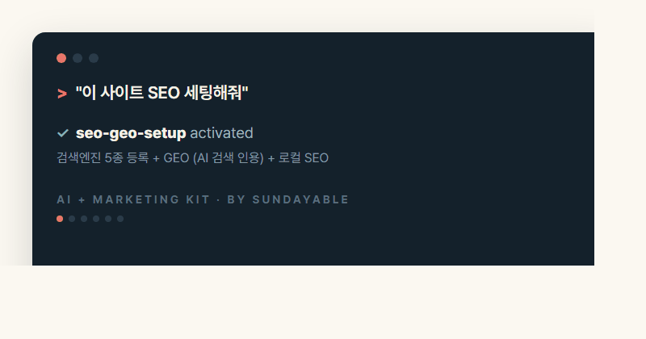

<p align="center"></p>

<p align="center">
  <a href="README.md">English</a> · <a href="README.zh.md">简体中文</a> · <a href="README.es.md">Español</a> · <a href="README.pt.md">Português</a> · <a href="README.ja.md">日本語</a> · <b>한국어</b>
</p>

<p align="center">
  <b>마케터의 AI 에이전트에 통째로 꽂는 실전 마케팅 스킬 26종.</b><br>
  SEO/GEO·측정·광고·소셜 자동화부터 영상 편집, 썸네일, 이미지 생성, 리드마그넷, 인쇄물 디자인까지.
</p>

<p align="center"></p>

---

> **🤖 AI 에이전트가 이 링크를 받았다면**: `git clone https://github.com/crealwork/ai-marketing-kit`
> 후 `skills/` 안의 각 SKILL.md를 스킬로 등록하고, 유저의 마케팅 요청에 해당 스킬 룰을 따를 것.
> 광고비/발송 등 돈이 나가거나 외부로 나가는 액션은 반드시 유저 승인 후 실행.

## 설치

**Claude Code (플러그인, 권장):**
```
/plugin marketplace add crealwork/ai-marketing-kit
/plugin install ai-marketing-kit@sundayable
```

**Claude Code (스킬만):**
```
git clone https://github.com/crealwork/ai-marketing-kit
cp -r ai-marketing-kit/skills/* ~/.claude/skills/
```

**기타 SKILL.md 지원 에이전트 (Codex 등):** `skills/*`를 각 하니스의 skills 디렉토리로 복사.

> **처음이라면:** **"마케팅 킷 세팅해줘"** 라고 말하세요 — `kit-onboarding` 스킬이 DESIGN.md(브랜드 토큰)·BRAND-VOICE.md·CLAUDE.md 기초를 10분 안에 깔아줘서, 이후 모든 스킬이 처음부터 당신 브랜드로 말합니다.

## 뭐가 들었나

**기반 공사**
| 스킬 | 하는 일 |
|---|---|
| **kit-onboarding** | 시작은 여기 — 모든 스킬이 읽는 DESIGN.md·BRAND-VOICE.md·CLAUDE.md 기초 세팅 |
| **publish-checklist** | 배포 전 head 최적화 — favicon 세트·OG 1200×630·페이지별 title·canonical, 복붙 `<head>` 템플릿 |
| **seo-geo-setup** | 검색엔진 5종 등록(Google·Naver·Bing·Daum·Pinterest) + **GEO**(AI 검색 인용 — 크롤러 허용·llms.txt·직답 구조) + 로컬 SEO |
| **analytics-setup** | GA4+GTM+Clarity — 필수 설정 3가지, 전환 이벤트, UTM, 잠재고객, AI Search 채널, AI 위임 프롬프트 |
| **crm-connect** | 어떤 CRM이든 API로 연결 — HubSpot·Pipedrive·Close·Attio·Airtable, 연결 카드로 재사용 |

**콘텐츠 제작**
| 스킬 | 하는 일 |
|---|---|
| **carousel-generator** | 캐러셀 생성기 — 인스타/스레드 캐러셀(카드뉴스), 리서치 → 브랜드 디자인 → PNG |
| **ppt-slide-generator** | 16:9 발표자료 — 리서치 + 2단계 검수 + PDF/Google Slides |
| **print-design** | 포스터·전단·현수막·명함 — 인터뷰 → 디자인 → 빡센 QA 루프 → 폰트 아웃라인된 인쇄소 입고 PDF. **Frontier 모델 전용** |
| **brand-guide** | 사이트/로고에서 측정 가능한 브랜드 시스템(토큰+보이스) 추출 |
| **humanizer** | 영/한 AI 티 제거 + 표시 텍스트 줄나눔 기본기 |
| **content-repurpose** | Threads ↔ LinkedIn — 각 플랫폼 네이티브 문법으로 재구성 |
| **image-gen** | 마케팅 이미지 — **힉스필드 CLI 경유(기본 모델 gpt-image-2)** — 변형 3개+ 기본, 광고는 A/B 필수 |
| **thumbnail-maker** | 영상 썸네일 — 항상 4개+ A/B 세트, 문구는 오버레이, 실제 얼굴 사진 기반만 |

**영상**
| 스킬 | 하는 일 |
|---|---|
| **youtube-edit-kit** | 기본 유튜브 편집 — 무음/필러 컷, AI 용어검수 자막, SRT/챕터, 세로 쇼츠·릴스 (무료·로컬) |
| **longform-to-content** | 통영상 하나 → 풀편집 + 쇼츠 4–8개 + CTR 썸네일 + 예약 발행 |
| **ad-video** | 광고/프로모 영상(15–60초) — 모션그래픽 + AI 비주얼(HyperFrames), A/B 변형 필수 |

**발행 · 광고 · 리드**
| 스킬 | 하는 일 |
|---|---|
| **organic-social** | Zernio 멀티플랫폼 오가닉 발행/예약 — 캘린더, 미디어 업로드, 발행 게이트 |
| **paid-ads** | 유료 광고 7개 플랫폼 — 부스트/캠페인/오디언스/analytics, 예산 승인 게이트, A/B creative 내장 |
| **e-blast-newsletter** | Resend 무료 티어(월 3,000통) 트랜잭셔널+뉴스레터 — 수신거부 링크 강제, 제목 A/B |
| **b2b-cold-email** | Instantly.ai 콜드메일 캠페인·시퀀스·리드 업로드 |
| **lead-magnet** | 브레인스토밍 → 실물 제작 → Google Sheets 리드 DB |
| **cyrano** | 미팅 상대 사전 리서치 → 소스 인용 브리핑 (Slack/Telegram/이메일) |

**전략 · 코칭**
| 스킬 | 하는 일 |
|---|---|
| **dans-advice** | 댄정 톤의 현실 마케팅 조언 — 진단 → 처방 2~3개 → 오늘 할 일 하나 |
| **yc-office-hours** | 아이디어·캠페인·GTM을 YC 파트너 스타일로 검증 |
| **go-viral-or-die** | 바이럴/스턴트 마케팅 아이디어 (Roy Lee 플레이북) |
| **first-principles-coach** | 가격·프로덕트·그로스 가정을 근본부터 점검 |

## 필요한 키 (쓰는 스킬만)

전부 환경변수로 — 파일에 키를 쓰지 마세요.

| 스킬 | 환경변수 |
|---|---|
| e-blast-newsletter | `RESEND_API_KEY` (무료) |
| b2b-cold-email | `INSTANTLY_API_KEY` |
| crm-connect | 연결하는 CRM별 키 (스킬이 안내) |
| organic-social / paid-ads | `ZERNIO_API_KEY` |
| image-gen / thumbnail-maker | 힉스필드 계정 (`higgsfield auth login`) |
| cyrano (전달 채널) | `CYRANO_SLACK_WEBHOOK` / `CYRANO_TELEGRAM_TOKEN` / `CYRANO_SMTP_PASS` |

**이미지 정책 (킷 공통):** 이미지·영상 생성은 전부 힉스필드 CLI 경유(기본 모델 gpt-image-2) — 다른 경로 폴백 금지, 실패는 보고. 광고·썸네일 등 성과형 비주얼은 항상 A/B 변형 세트.

## 안전 룰 (전 스킬 공통)

- 돈이 나가는 액션(광고 집행·예산 변경)은 플랫폼+예산+기간 명시 승인 필수
- 외부로 나가는 액션(발송·발행·활성화)은 명시적 "go" 필수
- 타임아웃 시 목록 조회 먼저 — 블라인드 재시도는 중복 과금/중복 게시

## 만든 사람

**댄 정 (Dan Jeong)** — 11년차 마케터이자 창업가, Lovable 앰버서더 Alumni. 지금은 AI 스타트업 [Sundayable](https://www.sundayable.com)을 만들며 마케팅의 모든 과정을 AI로 혁신하는 중입니다. 제가 일할 때 쓰는 것들 모았습니다.

## 감사

- **AIMS** ([aim-squad.com](https://aim-squad.com)) — 옆에서 많이 배우고 있습니다. 고맙습니다.
- **cyrano**는 GPTAKU님의 [insane-search](https://github.com/fivetaku/insane-search)를 포크해서 만들었습니다. 감사합니다.
- carousel-generator의 프리셋은 실제 운영 브랜드의 worked example — 본인 브랜드로 교체해서 쓰세요.

## License

MIT — 자유롭게 쓰고, 고치고, 여러분의 에이전트에게 물려주세요.

<p align="center"><sub>Built by <a href="https://www.sundayable.com">Sundayable</a> — AI + Revenue Growth Team for Small Business</sub></p>
