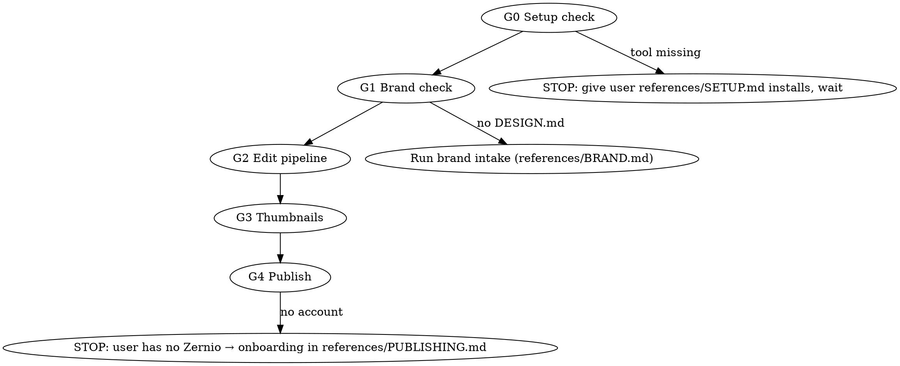

# Longform → Content

One raw recording in → a published content system out: relayouted full edit + burned
captions + cold open, 4–8 vertical shorts, CTR thumbnails, and scheduled posts.

**Every gate below is MANDATORY, in order. Skipping a gate or a self-test is a failure,
not a shortcut. Violating the letter of these rules is violating their spirit.**
Each rule exists because an agent already broke it in production (see Red Flags).

## Gates (run in order)

**G0 — Setup.** Verify EVERY tool in references/SETUP.md with its verify command. Any
missing → do not improvise; hand the user that file's install links + instructions and
wait. Never substitute a "similar" tool.

**G1 — Brand.** A `DESIGN.md` with measurable tokens (2 colors as hex, fonts as file
paths, wordmark rule) MUST exist before any pixel is rendered. None? Run the intake in
references/BRAND.md — derive from the user's site/deck, or interview, or apply the
neutral default. Never invent brand values silently.

**G2 — Edit.** Follow references/PIPELINE.md exactly: transcribe once (word-level,
cached) → measure layout geometry per recording → EDL (silence + disfluency cuts) →
relayout render → cold open + cards → corrected burned captions LAST → SRT + chapters →
frame-by-frame self-review before showing the user. Caption timing/text correctness has
its own bible: references/CAPTIONS.md — read it before writing any cue.

**G3 — Thumbnails.** references/THUMBNAILS.md. The main thumbnail's claim MUST be the
first spoken line of the cold open, and the user's real face photo MUST be used.

**G4 — Publish.** Packaging (titles, descriptions, chapters, cadence) per
references/YOUTUBE.md; mechanics per references/PUBLISHING.md via Zernio API.
Publishing is user-gated: get explicit per-destination approval ("올려줘/schedule it")
before any publishNow or scheduledFor call. On any timeout: LIST posts before
retrying — never blind-retry.

## Quick reference

| Task | Where |
|---|---|
| Tool installs + verify commands | references/SETUP.md |
| Brand intake / DESIGN.md template | references/BRAND.md |
| Full pipeline: cuts, disfluency, relayout, cold open | references/PIPELINE.md |
| Caption correctness: timing math, ASR corrections, styles | references/CAPTIONS.md |
| Shorts: moment selection, canvas zones, hook titles, first-frame rule | references/SHORTS.md |
| Thumbnail CTR rules + generation | references/THUMBNAILS.md |
| YouTube packaging: titles, descriptions, chapters, cadence, analytics | references/YOUTUBE.md |
| Zernio onboarding + API + scheduling | references/PUBLISHING.md |
| Reference implementations (adapt constants) | scripts/ + scripts/README.md |
| Agents without a skills harness (paste-in prompt + capability matrix) | BOOTSTRAP.md |

**Secrets rule (absolute):** skills, handoffs, and scripts reference secret NAMES
(`ZERNIO_API_KEY`) and where the user stores them — never values, never the user's
account IDs, never their key-file contents. Scrub before sharing anything portable.

## Red Flags — STOP, you are about to repeat a real production failure

| Rationalization | Reality (it already happened) |
|---|---|
| "I'll put the absolute path in the ffmpeg filter" | `C:` colon breaks filter parsing. Relative path + cwd only. |
| "Python print is fine without utf-8" | cp1252 crashed on Korean. `PYTHONUTF8=1` + reconfigure, always. |
| "The POST timed out, I'll just retry" | The post WAS created. Blind retry = duplicate publish. LIST first. |
| "ASR captions are probably fine" | Scribe mangled ~95 terms in one hour of Korean. Build corrections, grep-verify zero residuals. |
| "The image model will render the text correctly" | It dropped "$20" → "0". READ the output, regenerate on any glyph error. Never inpaint. |
| "Thumbnail and intro don't need to match" | Click → first line must repay the thumbnail claim. Reorder the cold open. |
| "I can skip frame review, the commands succeeded" | Silent failures are invisible in exit codes. Extract frames and READ them. |
| "One-pass filtergraph is simpler" | Double-encodes when overlays change. Per-segment extract → `-c copy` concat. |
| "Captions can go before the overlay" | Overlays hide captions. Captions are LAST. |
| "User has no brand, I'll just pick something" | Run the intake. Defaults are chosen BY RULE, not by taste. |

## Scope limits

- Talking-head/presentation recordings. Not for music videos or animation-first work.
- Voice processing (denoise/EQ) is opt-in only — default keeps original audio untouched.
- The agent's ceiling is staged/scheduled posts; the user presses the final go.
