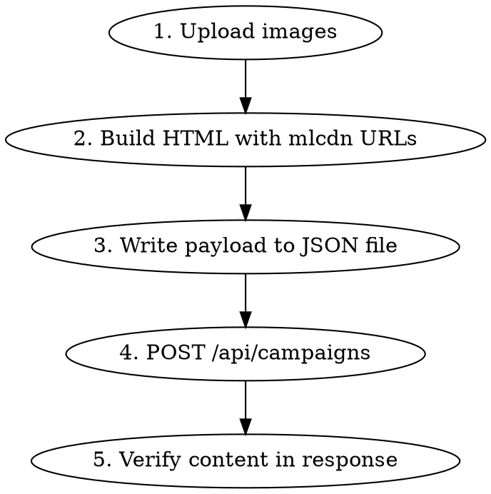

# MailerLite Newsletter Campaign

## Overview

Create and manage MailerLite email campaigns via their REST API. This skill captures proven API patterns and critical gotchas discovered through production use.

## API Basics

**Base URL:** `https://connect.mailerlite.com/api`

**Auth:** `Authorization: Bearer $MAILERLITE_API_KEY`

**Key location:** env var `MAILERLITE_API_KEY` (MailerLite → Integrations → API; never hardcode)

```bash
ML_KEY=$MAILERLITE_API_KEY
```

## Campaign Creation Workflow



### Step 1: Upload Images

```bash
curl -s -X POST "https://connect.mailerlite.com/api/images" \
  -H "Authorization: Bearer $ML_KEY" \
  -H "Accept: application/json" \
  -F "file=@/path/to/image.png"
```

Response gives `url` field: `https://storage.mlcdn.com/account_image/ACCOUNT_ID/HASH.png`

**CRITICAL:** Always upload images to MailerLite CDN first. External URLs (Vercel, S3, etc.) will show as broken in MailerLite preview — their preview only renders `storage.mlcdn.com` images.

### Step 2: Build HTML

- Use mlcdn URLs from Step 1 for all custom images
- Include preheader as hidden div (see Preheader section)
- Use `{$unsubscribe}` and `{$preferences}` template variables in footer (rendered only on actual send, not in preview)

### Step 3: Create Campaign

Payload is too large for inline curl — write to file first:

```python
import json
payload = {
    "name": "Campaign Name",
    "language_id": 4,  # English (en-US). DO NOT use 1 — that's Lithuanian.
    "type": "regular",
    "emails": [{
        "subject": "Subject Line",
        "from_name": "Sender Name",
        "from": "sender@domain.com",
        "content": html_content
    }],
    "groups": ["group_id_1", "group_id_2"]
}
with open("payload.json", "w", encoding="utf-8") as f:
    json.dump(payload, f, ensure_ascii=False)
```

```bash
curl -s -X POST "https://connect.mailerlite.com/api/campaigns" \
  -H "Authorization: Bearer $ML_KEY" \
  -H "Content-Type: application/json" \
  -H "Accept: application/json" \
  --data-binary @payload.json
```

## Critical Gotchas

### Never Activate or Send a Campaign Yourself

The AI's ceiling is a staged draft. Final activate / schedule / send on any campaign
(especially cold) is Dan's call — hand over the draft link and stop. No exceptions,
even when asked to "finish the campaign."

### Preview Blanks ALL Unsubscribe URLs (Not a Bug in Your HTML)

Campaign preview renders every `{$unsubscribe}` / `{$preferences}` URL as empty — they
resolve only on actual send. Don't "fix" the template because preview looks broken;
verify via the `missing_data` field instead. Related quirks: `filter[search]` on
subscribers matches email only (not name), and a spam complainer can still show as
ACTIVE — unsubscribe them immediately when found.

### `language_id` Defaults Are Account-Specific — Always Pass `4` for English

MailerLite's `language_id` is NOT globally standardized. On a real production account, `1 = Lithuanian` and `4 = English (en-US)`. Omitting the field or guessing `1` produces a campaign flagged as Lithuanian in the "Send or schedule" screen — breaks translated boilerplate (unsubscribe, preferences, legal footer).

**Always pass `"language_id": 4`** for English campaigns. To verify IDs for your account:

```bash
curl -s "https://connect.mailerlite.com/api/campaigns/languages" \
  -H "Authorization: Bearer $ML_KEY" | python -c "import sys,json; [print(x['id'], x['shortcode'], x['name']) for x in json.load(sys.stdin)['data']]"
```

### PUT Does NOT Update Content

`PUT /api/campaigns/{id}` does NOT reliably update email content. MailerLite replaces custom image URLs with `groot.mailerlite.com` placeholder images.

**Fix:** DELETE the campaign and POST a new one.

```bash
# Delete old
curl -s -X DELETE "https://connect.mailerlite.com/api/campaigns/{id}" \
  -H "Authorization: Bearer $ML_KEY"

# Create new
curl -s -X POST "https://connect.mailerlite.com/api/campaigns" \
  --data-binary @payload.json ...
```

### Preheader Field Is NOT Writable via the API

Verified 2026-04-17 across both APIs:
- **Connect API (v3):** `preheader` / `preview_text` / `preview` / `snippet` / `preheader_text` are ALL rejected under `emails[0]` with `"The emails.0 field must be an array"` (422). Top-level variants silently dropped.
- **Classic API (v2, `api.mailerlite.com`):** `/campaigns/{id}/content` returns `403 error 1010` for modern tokens.

The field IS readable in GET (`preheader: null` when unset) but no public endpoint accepts writes. Don't re-probe — use the two-layer fix.

**Two-layer fix — use BOTH:**

1. **Hidden `<div>` in HTML** — what recipients actually see in Gmail/Outlook inbox preview:

```html
<body>
<!-- Preheader -->
<div style="display:none;max-height:0;overflow:hidden;mso-hide:all;">
  Your preheader text here
</div>
<div style="display:none;max-height:0;overflow:hidden;mso-hide:all;">
  &nbsp;&zwnj;&nbsp;&zwnj;&nbsp;&zwnj;&nbsp;&zwnj;&nbsp;&zwnj;&nbsp;&zwnj;&nbsp;&zwnj;&nbsp;&zwnj;&nbsp;&zwnj;&nbsp;&zwnj;
</div>
<!-- Email content -->
```

The second div with `&zwnj;` padding prevents email clients from pulling body text into the preheader area.

2. **Manual dashboard step (once per campaign)** — only if the user wants the "Preheader" line in the Send/Schedule summary to show the text instead of `-`:
   - Open the campaign → click **Edit content** → open email settings (gear / "Email settings") → paste into the **"Email preview text"** field → Save.
   - No effect on recipients (the hidden-div already wins). Cosmetic for the dashboard summary only.

**After creating a draft via API, ALWAYS tell the user:** "Preheader reaches recipients via the hidden HTML div. If you want it visible on the Send/Schedule summary (shows `-` by default), paste into the 'Email preview text' field in Edit content — the API cannot set that."

**ALWAYS include the hidden-div preheader** in every campaign.

### Unknown Fields Break the API

Adding ANY unrecognized field to the `emails` object (like `preheader`, `preview_text`, `custom_field`) causes the cryptic error: `"The emails.0 field must be an array."` Stick to: subject, from_name, from, content.

### `<body>` Tag Inline Styles Are Stripped

Verified 2026-04-19. MailerLite's HTML pipeline replaces `<body style="...">` with `<body class="" style="">` on save — ALL `font-family`, `color`, `background`, etc. set only on the body tag are silently removed. Paragraphs inheriting `font-family` from `<body>` fall back to browser default (usually Times New Roman in some clients — ugly).

**Fix — apply typography styles inline to every text element:**

1. Set `font-family` on every `<p>`, `<h*>`, and text-bearing `<td>` individually.
2. Also set it on the outer wrapper `<table>` (those ARE preserved) as a fallback parent.
3. The Google Fonts `<link>` in `<head>` IS preserved across POST, so brand fonts load in Apple Mail / iOS / Gmail web.

**Reusable Python regex helper** (use after assembling HTML, before POST):

```python
import re

FONT = "'Brand Font',-apple-system,BlinkMacSystemFont,'Segoe UI',Arial,Helvetica,sans-serif"

def inject_font_family(html: str, font: str = FONT) -> str:
    """Inject font-family inline into every <p>/<a> that lacks it.
    Preserves explicit font-family declarations (e.g. display serifs on headings)."""
    def _add(tag_match, require_font_size=False):
        full, style = tag_match.group(0), tag_match.group(1)
        if 'font-family' in style:
            return full
        if require_font_size and 'font-size' not in style:
            return full
        new = style.rstrip(';') + ';font-family:' + font + ';'
        return full.replace('style="' + style + '"', 'style="' + new + '"')
    html = re.sub(r'<p [^>]*style="([^"]*)"[^>]*>', lambda m: _add(m), html)
    html = re.sub(r'<a [^>]*style="([^"]*)"[^>]*>', lambda m: _add(m, require_font_size=True), html)
    return html
```

**Fallback stack pattern for modern brand sans-serif:** `'Brand', -apple-system, BlinkMacSystemFont, 'Segoe UI', Arial, Helvetica, sans-serif`. Outlook Windows ignores Google Fonts but renders Segoe UI natively — a significant upgrade over Arial.

### Updating a Draft = DELETE + POST (No In-Place Edits)

The canonical edit workflow: fetch current campaign HTML, mutate locally, `DELETE /campaigns/{old_id}`, then `POST /campaigns` with new payload. The new campaign gets a new ID. Always bump a filename suffix (`payload_v2.json`, `payload_v3.json`) so you can diff old/new if something regresses. Verify after: grep for `groot.mailerlite` (none should appear), confirm text that was added (e.g. `'Refer & Earn' in content`), confirm text that was removed (e.g. `'OldReward' not in content`).

### Content Comes Back Whitespace-Reformatted on GET

MailerLite pretty-prints the HTML it returns from GET — so `<a href="...">Terms &amp; Conditions</a>` stored on one line may come back with the inner text split across newlines (`Terms &amp;\n      Conditions`). Plain substring checks like `'Referral Program Terms' in content` can return False even when the content is correct. When verifying, use regex with whitespace tolerance (`r'Referral\s+Program\s+Terms'`) or check for the URL/href instead of the link text.

## Quick Reference

| Endpoint | Method | Use |
|----------|--------|-----|
| `/api/campaigns` | POST | Create campaign |
| `/api/campaigns/{id}` | DELETE | Delete campaign |
| `/api/campaigns?filter[status]=sent` | GET | List sent campaigns |
| `/api/campaigns?filter[status]=draft` | GET | List draft campaigns |
| `/api/groups` | GET | List subscriber groups |
| `/api/images` | POST | Upload image (multipart form) |

**Note:** Use URL-encoded filters: `filter%5Bstatus%5D=sent`. The `limit` param only accepts specific values (10, 25, 50, 100).

## Verification After Creation

Always verify the created campaign content:

```bash
curl -s "https://connect.mailerlite.com/api/campaigns/{id}" ... | python3 -c "
import sys,json,re
data = json.load(sys.stdin)
content = data['data']['emails'][0].get('content','')
# Check for placeholder images (BAD)
if 'groot.mailerlite' in content:
    print('WARNING: groot placeholders found - DELETE and recreate')
# Check for preheader
if 'display:none' in content and 'preheader' in content.lower():
    print('Preheader: OK (in HTML)')
# Check images
for m in re.finditer(r']+src=['\"]([^'\"]+)', content):
    print(f'Image: {m.group(1)[:80]}')
"
```

## Template Variables

| Variable | Purpose | Preview |
|----------|---------|---------|
| `{$unsubscribe}` | Unsubscribe link | Not rendered (shows on actual send) |
| `{$preferences}` | Email preferences link | Not rendered (shows on actual send) |
| `{$body_top}` | Auto-injected by MailerLite | Ignore |
