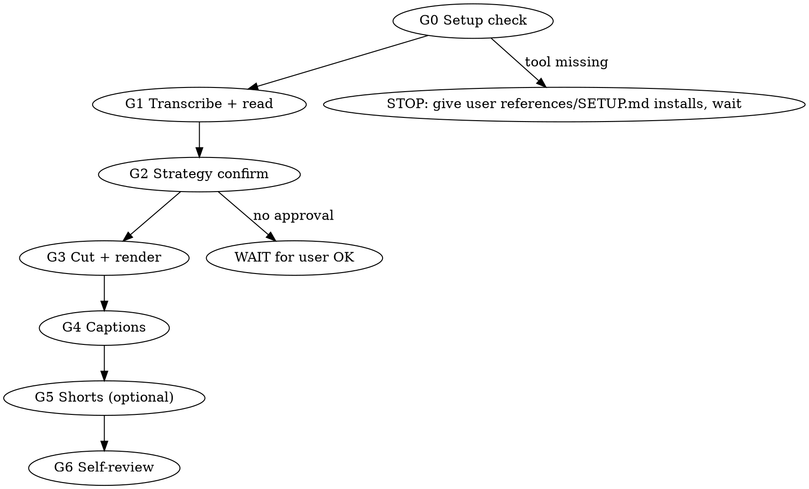

# YouTube Edit Kit

One source video in → a clean YouTube cut out: silence + disfluency cuts, burned
corrected captions, SRT + chapters, and optional vertical shorts. Free and local —
ffmpeg + faster-whisper, no API key.

**Every gate below is MANDATORY, in order. Skipping a gate or a self-test is a
failure, not a shortcut. Violating the letter of these rules is violating their
spirit.** Each rule exists because an agent already broke it in production.

## Gates (run in order)

**G0 — Setup.** Verify EVERY tool in references/SETUP.md with its verify command.
Missing → hand the user that file's install instructions and wait. Never
substitute a "similar" tool.

**G1 — Transcribe.** references/EDIT.md §1: word-level verbatim, cached per
source, then READ the entire packed transcript. Cut decisions come from reading.

**G2 — Strategy confirm.** Present cut approach + estimated length (+ shorts
count and hook list if applicable) and WAIT for the user's OK. Rendering before
approval is a violation, not initiative.

**G3 — Cut.** references/EDIT.md §3–5: EDL (silence + disfluency) → per-segment
render → lossless concat.

**G4 — Captions.** references/CAPTIONS.md — read it before writing any cue.
Term review first (scan_terms.py + reading; YOU are the AI reviewer for proper
nouns/jargon/onomatopoeia — ask the user what you can't verify), then
corrections dictionary, output-timeline mapping, burn LAST.

**G5 — Shorts.** references/SHORTS.md — moment selection, hook titles,
first-frame rule, blocking self-tests.

**G6 — Self-review.** references/EDIT.md §7: look at frames, check duration,
spot-check sync. If you wouldn't ship it, don't present it.

## Hard rules (production correctness — non-negotiable)

1. Never cut inside a word — snap every edge to a word boundary, then pad it.
2. Never re-transcribe an edited file for captions — map original timestamps
   through the piece table (CAPTIONS.md §2).
3. Captions burn LAST, after every overlay, with `-c:a copy`.
4. Per-segment extract → lossless `-c copy` concat; identical codec params on
   every clip; 30ms afades at every boundary.
5. Cache transcripts per source; never re-transcribe an unchanged file.
6. No render before the user approves the strategy; no publish without an
   explicit per-destination "go".
7. Verify by LOOKING at extracted frames, never by exit code alone.
8. Captions never burn without a REVIEWED corrections.json — scan_terms.py +
   full transcript read; empty `[]` only after the review actually happened.

## Quick reference

| Task | Where |
|---|---|
| Tool installs + verify commands | references/SETUP.md |
| Full pipeline: EDL, fillers, render, burn | references/EDIT.md |
| Caption correctness: mapping math, corrections, styles | references/CAPTIONS.md |
| Shorts: selection, layout, hooks, first-frame rule | references/SHORTS.md |
| Runnable CLIs (transcribe → EDL → fillers → cut → terms → SRT → shorts) | scripts/ |

## Red flags — STOP, you are rationalizing

| Thought | Reality |
|---|---|
| "I'll re-transcribe the edit for captions" | ~1s drift per cut, compounds. Map through the piece table. |
| "Burn captions first, overlay after" | Overlays hide captions. Silent failure. Captions LAST. |
| "One-pass filtergraph is simpler" | Double-encodes when anything is added. Per-segment + concat. |
| "The cut sounds fine without fades" | Pops at boundaries on headphones. 30ms afades, every edge. |
| "User is offline, I'll just render" | Strategy confirm is blocking. Wait. |
| "Exit code 0, ship it" | Look at the frames. Every self-test is visual. |
| "The transcript looks clean, skip the term review" | ASR errors are systematic, not obvious. Run scan_terms.py and READ. |

## Upgrade path (optional richer skills, if installed)

- **longform-to-content** — webinars/lectures at scale: relayout + PIP, cold open,
  CTR thumbnails, scheduled publishing.
- **embedded-captions** — designed caption identities with subject occlusion.
- **talking-head-recut** — kinetic graphic overlay cards (lower-thirds, callouts).
